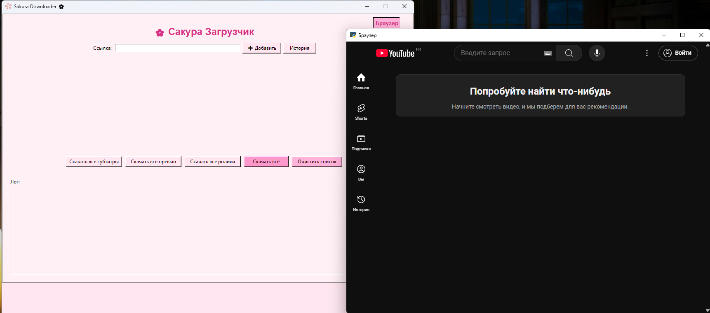

Данная программа позволяет скачивать ролики и превью к ним при наличии прокси.  
P.s а еще имеет прикольный розовый дизайн

# Sakura Downloader 🌸



**Sakura Downloader** — это простой и удобный графический загрузчик видео и аудио с YouTube и других сайтов.

---

## Особенности

- Загрузка видео и аудио с YouTube с выбором качества и формата
- Скачивание превью и субтитров
- История скачиваний
- Встроенный браузер (открывается отдельным окном)
- Красивый розовый интерфейс

---

## Структура проекта

```
z3552_inj_prog/
│
├── main.py                # Точка входа
├── ui_sakura.py           # Основной интерфейс
├── browser_panel.py       # Окно браузера
├── assets/
│   └── favicon.ico        # Иконка приложения
├── history/               # История скачиваний (если используется)
│   └── history.json
├── README.md
├── requirements.txt
└── ... (другие служебные файлы и папки)
```

---

## Установка

1. Установите Python 3.7+
2. Установите зависимости:
    ```bash
    pip install -r requirements.txt
    ```
3. Запустите приложение:
    ```bash
    python main.py
    ```

---

## Зависимости

- [yt-dlp](https://github.com/yt-dlp/yt-dlp)
- [ffmpeg](https://ffmpeg.org/)
- requests
- Pillow
- pywebview

---

## Использование

- Введите ссылку на видео и нажмите "Добавить"
- Выберите нужный формат и скачайте видео, превью или субтитры
- Для просмотра сайтов используйте кнопку "Браузер"

---

## Лицензия

MIT

---

## Скриншот


